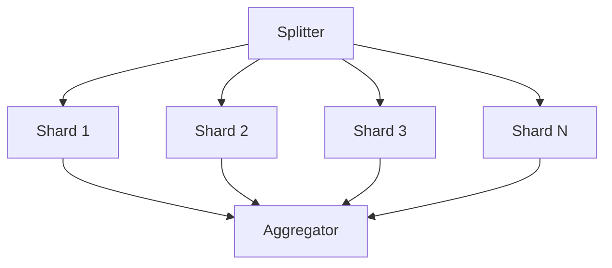

# Batch Migration Patterns

Decision frameworks, checkpointing strategies, parallelization patterns, cost formulas, and common pitfalls for migrating legacy batch applications to serverless infrastructure.

---

## Decision Matrix for Target Platform Selection

Use this matrix to select the right serverless/container target for each batch job.

### Primary Decision Criteria

| Factor | Cloud Functions | Cloud Run Jobs | GKE CronJob | Cloud Workflows | Cloud Composer |
|--------|----------------|----------------|-------------|-----------------|----------------|
| **Max duration** | 9 min (gen1) / 60 min (gen2) | 24 hours | Unlimited | 1 year | Unlimited |
| **Max memory** | 32 GB | 32 GB | Node limit | N/A (orchestrator) | N/A (orchestrator) |
| **State** | Stateless only | Stateless or checkpointed | Full state support | Stateless steps | Stateless tasks |
| **Scaling** | Auto (up to 3000) | Manual task count | Pod autoscaling | Sequential/parallel steps | DAG parallelism |
| **VPC access** | Connector required | Connector or Direct VPC | Native | Via Cloud Run | Native |
| **Cold start** | 100ms-10s | 5-30s | Pod scheduling | Instant (orchestrator) | Instant (orchestrator) |
| **Pricing model** | Per invocation + duration | Per vCPU-second + memory | Node cost (always-on) | Per step execution | Cluster + per DAG run |
| **Best for** | Event-triggered, short jobs | Scheduled, medium jobs | Long/heavy jobs | Multi-step pipelines | Complex DAGs |

### Quick Decision Flow

```
Is the job event-triggered AND < 15 min?
  YES → Cloud Functions
  NO  ↓
Is the job < 1 hour AND stateless or checkpointed?
  YES → Cloud Run Jobs
  NO  ↓
Does it need > 32 GB memory OR GPU OR persistent volumes?
  YES → GKE CronJob
  NO  ↓
Is it a multi-step pipeline with < 10 steps?
  YES → Cloud Workflows + Cloud Run Jobs
  NO  ↓
Is it a complex DAG with many dependencies?
  YES → Cloud Composer (Airflow)
```

---

## Checkpointing Strategies

### Cloud Storage Checkpointing

Best for Cloud Run Jobs and stateless containers.

```java
// Checkpoint pattern for batch processing
public class GcsCheckpointManager {
    private final Storage storage;
    private final String bucketName;

    public void saveCheckpoint(String jobId, long lastProcessedOffset) {
        BlobInfo blob = BlobInfo.newBuilder(bucketName,
            "checkpoints/" + jobId + "/offset.json").build();
        storage.create(blob,
            ("{\"offset\":" + lastProcessedOffset + "}").getBytes());
    }

    public long loadCheckpoint(String jobId) {
        Blob blob = storage.get(bucketName,
            "checkpoints/" + jobId + "/offset.json");
        if (blob == null) return 0L;
        // Parse and return offset
    }
}
```

**When to use:** Jobs that process large datasets and may be interrupted by timeouts or failures. Write checkpoint every N records or every M minutes.

### Redis Checkpointing

Best for low-latency checkpoint writes during high-throughput processing.

```java
// Redis checkpoint for high-frequency updates
public class RedisCheckpointManager {
    private final JedisPool pool;

    public void saveCheckpoint(String jobId, Map<String, String> state) {
        try (Jedis jedis = pool.getResource()) {
            jedis.hset("checkpoint:" + jobId, state);
            jedis.expire("checkpoint:" + jobId, 86400); // 24h TTL
        }
    }
}
```

**When to use:** Jobs that need to checkpoint every few seconds. Use Memorystore for Redis on GCP.

### Database Checkpointing

Best for jobs that already use a database and need transactional consistency.

```sql
CREATE TABLE batch_checkpoints (
    job_id VARCHAR(255) PRIMARY KEY,
    last_processed_id BIGINT NOT NULL,
    last_processed_at TIMESTAMP NOT NULL,
    metadata JSONB,
    updated_at TIMESTAMP DEFAULT CURRENT_TIMESTAMP
);
```

**When to use:** Jobs where the checkpoint must be atomically consistent with the data being processed (same transaction).

---

## Parallelization Patterns for Batch Chains

### Pattern 1: Fan-Out / Fan-In

Replace sequential processing with parallel shards.



**Implementation:** Use Cloud Run Jobs with `taskCount > 1` and `CLOUD_RUN_TASK_INDEX` to partition work.

### Pattern 2: Pipeline Parallelization

Identify independent steps in a sequential chain.

```
BEFORE (sequential):
  Job A → Job B → Job C → Job D → Job E

AFTER (parallelized):
  Job A → [Job B, Job C] → Job D → Job E
         (B and C have no dependency on each other)
```

**Implementation:** Cloud Workflows with parallel branches or Airflow DAG with independent task groups.

### Pattern 3: Event-Driven Chaining

Replace polling-based triggers with event-driven triggers.

```
BEFORE: Job A writes file → Scheduler polls for file → Job B starts
AFTER:  Job A writes to GCS → GCS event → Pub/Sub → Job B triggered
```

**Implementation:** Cloud Storage notifications to Pub/Sub, Eventarc triggers for Cloud Run Jobs.

### Airflow DAG Example (Pipeline with Parallelization)

```python
from airflow import DAG
from airflow.providers.google.cloud.operators.cloud_run import (
    CloudRunExecuteJobOperator,
)
from datetime import datetime, timedelta

default_args = {
    "owner": "batch-team",
    "retries": 2,
    "retry_delay": timedelta(minutes=5),
    "email_on_failure": True,
    "email": ["batch-alerts@company.com"],
}

with DAG(
    "nightly_batch_pipeline",
    default_args=default_args,
    schedule_interval="0 2 * * *",
    start_date=datetime(2024, 1, 1),
    catchup=False,
    tags=["batch", "nightly"],
) as dag:

    extract = CloudRunExecuteJobOperator(
        task_id="extract_data",
        project_id="my-project",
        region="us-central1",
        job_name="batch-extract",
    )

    transform_customers = CloudRunExecuteJobOperator(
        task_id="transform_customers",
        project_id="my-project",
        region="us-central1",
        job_name="batch-transform-customers",
    )

    transform_orders = CloudRunExecuteJobOperator(
        task_id="transform_orders",
        project_id="my-project",
        region="us-central1",
        job_name="batch-transform-orders",
    )

    load = CloudRunExecuteJobOperator(
        task_id="load_warehouse",
        project_id="my-project",
        region="us-central1",
        job_name="batch-load",
    )

    # Extract first, then transforms in parallel, then load
    extract >> [transform_customers, transform_orders] >> load
```

### Cloud Workflows Example

```yaml
main:
  steps:
  - extract:
      call: googleapis.run.v1.namespaces.jobs.run
      args:
        name: namespaces/my-project/jobs/batch-extract
      result: extractResult

  - parallel_transforms:
      parallel:
        branches:
        - transform_customers:
            steps:
            - run_customer_transform:
                call: googleapis.run.v1.namespaces.jobs.run
                args:
                  name: namespaces/my-project/jobs/batch-transform-customers
        - transform_orders:
            steps:
            - run_order_transform:
                call: googleapis.run.v1.namespaces.jobs.run
                args:
                  name: namespaces/my-project/jobs/batch-transform-orders

  - load:
      call: googleapis.run.v1.namespaces.jobs.run
      args:
        name: namespaces/my-project/jobs/batch-load
      result: loadResult

  - notify:
      call: http.post
      args:
        url: https://hooks.slack.com/services/XXX
        body:
          text: "Nightly batch pipeline completed successfully"
```

---

## Cost Estimation Formulas

### Current State: Always-On VMs

```
Monthly VM Cost = (vCPU count * vCPU price * 730 hours)
               + (Memory GB * memory price * 730 hours)
               + persistent disk costs
               + network egress

Example (n2-standard-4):
  4 vCPU * $0.0971/hr * 730 = $283.53
  16 GB  * $0.013/hr  * 730 = $151.84
  100 GB SSD                = $17.00
  Total                     ≈ $452/month
```

### Target State: Cloud Run Jobs

```
Monthly Cloud Run Cost = Σ (per execution):
  (vCPU allocated * vCPU price/sec * duration seconds)
  + (Memory GB * memory price/sec * duration seconds)
  + (executions * per-request fee)

Example (same workload, 2 vCPU, 4 GB, runs 1hr/day):
  2 vCPU * $0.00002400/sec * 3600 * 30 = $5.18
  4 GB   * $0.00000250/sec * 3600 * 30 = $1.08
  30 executions * $0.0                  = $0.00
  Total                                ≈ $6.26/month
```

### Target State: GKE CronJob (Autopilot)

```
Monthly GKE Cost = Σ (per execution):
  (vCPU requested * vCPU price/sec * duration)
  + (Memory requested * memory price/sec * duration)
  + cluster management fee

Example (2 vCPU, 4 GB, runs 1hr/day):
  2 vCPU * $0.0000340/sec * 3600 * 30 = $7.34
  4 GB   * $0.0000037/sec * 3600 * 30 = $1.60
  Management fee                       = $74.40
  Total                               ≈ $83.34/month
```

### Comparison Summary

| Platform | Monthly Cost | Utilization | Best When |
|----------|-------------|-------------|-----------|
| Always-on VM | $452 | 4.2% (1hr/day) | Never for batch |
| Cloud Run Jobs | $6 | 100% (pay per use) | < 24hr jobs, simple scheduling |
| GKE Autopilot | $83 | 100% (pay per use) | Multiple jobs share cluster overhead |

---

## Common Migration Pitfalls

### 1. Timeout Miscalculation

**Problem:** Job occasionally exceeds Cloud Run's 24-hour limit or Cloud Functions' 9/60-minute limit.

**Solution:** Profile actual P99 execution time, not average. Add 50% buffer. Implement checkpointing so jobs can resume after timeout.

### 2. Missing State Externalization

**Problem:** Legacy batch writes temporary files to local disk, which disappears in ephemeral containers.

**Solution:** Replace local file I/O with Cloud Storage. Use `/tmp` only for truly temporary data that fits in memory limits. Mount Cloud Storage FUSE for large file access.

### 3. Hardcoded Configuration

**Problem:** Database URLs, file paths, and credentials hardcoded in properties files or source code.

**Solution:** Externalize all configuration to environment variables. Store secrets in Secret Manager. Use ConfigMaps for non-sensitive configuration in K8s.

### 4. Singleton Assumption

**Problem:** Job assumes it is the only instance running. Cloud Scheduler may trigger duplicate executions on retries.

**Solution:** Use `concurrencyPolicy: Forbid` for K8s CronJobs. Implement distributed locking (e.g., Cloud Storage object lock, database advisory lock) for Cloud Run Jobs. Design for idempotent execution.

### 5. Network Access Gaps

**Problem:** Batch job accesses on-premises databases or internal APIs via private network. Cloud Run has no default VPC access.

**Solution:** Configure VPC Connector or Direct VPC egress for Cloud Run. Set up Cloud VPN or Interconnect for on-premises access. Use Cloud SQL Auth Proxy for managed databases.

### 6. Logging and Monitoring Gaps

**Problem:** Legacy batch writes logs to files on local disk. No structured logging. No alerting on failures.

**Solution:** Write JSON-structured logs to stdout/stderr (automatically captured by Cloud Logging). Set up Cloud Monitoring alerts for job failure, duration exceeding threshold, and resource exhaustion.

### 7. Large Artifact Size

**Problem:** Legacy batch application JAR is > 1 GB with bundled dependencies, causing slow container startup.

**Solution:** Use multi-stage Docker builds. Exclude test and unused dependencies. Use `jlink` for custom JRE. Consider GraalVM native-image for fast startup. Use Artifact Registry for image caching.

### 8. Batch Chain Timing Dependencies

**Problem:** Legacy batch chain uses rigid time-based scheduling (Job B starts at 3:00 AM, assuming Job A finished by then). In cloud, execution times vary.

**Solution:** Replace time-based chaining with event-driven chaining. Use Cloud Workflows or Airflow to express actual dependencies. Job B starts when Job A completes, not at a fixed time.

### 9. Ignoring Cold Start Impact

**Problem:** First execution after idle period takes significantly longer due to container image pull and JVM startup.

**Solution:** Use smaller base images (Alpine, distroless). Pre-warm with minimum instances if latency-sensitive. Use GraalVM native-image for near-instant startup. Account for cold start in timeout calculations.

### 10. Insufficient Retry Design

**Problem:** Legacy batch has no retry logic — operators manually restart failed jobs.

**Solution:** Configure `maxRetries` in Cloud Run Jobs. Set `backoffLimit` in K8s CronJobs. Implement application-level retry with exponential backoff for transient failures (database timeouts, API rate limits). Add dead-letter handling for permanent failures.
