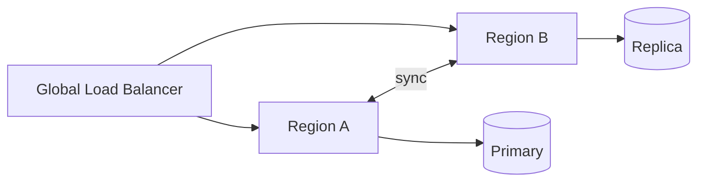
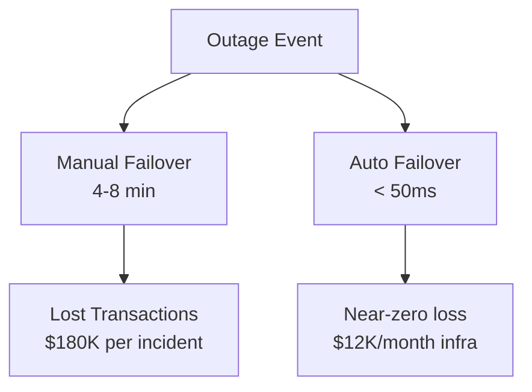

# Diagram Guide for Clarity Presenter

How to include diagrams as visual evidence in SCQA assertion-evidence presentations. Diagrams support assertion headlines — they are the evidence, not decoration.

## Diagrams as Evidence

The assertion-evidence model (see `assertion-evidence-guide.md`) lists **Diagrams and Architecture** as a primary evidence type. Use diagrams when the assertion is about system structure, data flow, or relationships.

The diagram supports the headline claim. It does not restate it.

| Slide Type | Diagram Role |
|-----------|--------------|
| **Technical** (white) | Architecture, data flow, sequence diagrams — shows *how* |
| **Business** (dark) | Process flow, impact diagrams, timelines — shows *why it matters* |

## MARP Limitation

MARP has no native Mermaid or diagram rendering support. Diagrams must be pre-rendered as images (SVG or PNG) and embedded using standard MARP image syntax.

## Approach A: Pre-rendered SVG (Recommended)

The most reliable method. Create diagrams externally, export as SVG, embed as images.

### Workflow

1. **Create the diagram** using [mermaid.live](https://mermaid.live), a local editor, or Mermaid CLI.
2. **Export as SVG** (preferred) or PNG.
3. **Place the file** alongside the deck (e.g., `./diagrams/architecture.svg`).
4. **Embed in MARP** below the assertion headline.

### MARP Embedding Syntax

Below the assertion headline (most common for clarity decks):
```markdown
## Active-active replication eliminates cold-start failover delays


```

Split layout (diagram + evidence text side by side):
```markdown


## Service mesh reduces inter-service latency by 40%
- Sidecar proxy handles routing
- Connection pooling across pods
```

Full-bleed background (less common for clarity, useful for impact visuals):
```markdown

```

### Mermaid CLI

Render SVG locally without a browser:

```bash
npx -p @mermaid-js/mermaid-cli mmdc -i diagram.mmd -o diagram.svg --theme neutral
```

Batch render all diagrams:

```bash
npx -p @mermaid-js/mermaid-cli mmdc -i diagrams/ -o output/ -e svg
```

Recommended Mermaid themes:
- `neutral` — for technical slides (white background)
- `dark` — for business slides (`invert` class, dark background)

## Approach B: Kroki URL-Based Rendering

Encode diagram source as a URL. No local tooling needed, but requires internet.

### Workflow

1. **Write the diagram** in Mermaid syntax.
2. **Base64-encode** the source:
   ```bash
   echo 'graph LR; A-->B-->C' | base64 | tr -d '\n'
   ```
3. **Embed as image URL** in MARP:
   ```markdown
   ## Request routing shifts to the nearest healthy region in under 50ms

   
   ```

Kroki supports Mermaid, PlantUML, Graphviz, D2, and other diagram formats: `https://kroki.io/{type}/svg/{base64}`.

## Approach C: Mermaid CLI Batch Workflow

For decks with multiple diagrams, set up a build step:

```bash
# 1. Create diagrams/ folder with .mmd files
mkdir -p diagrams

# 2. Render all to SVG (neutral theme for technical slides)
for f in diagrams/*.mmd; do
  npx -p @mermaid-js/mermaid-cli mmdc -i "$f" -o "${f%.mmd}.svg" --theme neutral
done

# 3. Optionally render dark variants for business slides
for f in diagrams/*.mmd; do
  npx -p @mermaid-js/mermaid-cli mmdc -i "$f" -o "${f%.mmd}-dark.svg" --theme dark
done

# 4. Build the deck
npx @marp-team/marp-cli@latest deck.md --html --theme gcloud-theme.css -o deck.html
```

## Diagram Types by Evidence Category

| Evidence Type | Diagram Type | When to Use |
|--------------|-------------|-------------|
| Architecture | Flowchart, C4 context | System structure assertions ("Service mesh routes traffic through sidecar proxies") |
| Data flow | Sequence diagram | Integration/pipeline assertions ("Events flow from ingestion to analytics in under 2 seconds") |
| Comparison | Side-by-side flowcharts | Before/after assertions ("Migration reduces the data path from 5 hops to 2") |
| Process | Activity diagram | Workflow assertions ("Automated rollback triggers within one health-check interval") |
| Timeline | Simplified Gantt | Migration/rollout assertions ("Three-phase migration completes in 8 weeks") |
| Metrics | Use `stats` class instead | Quantitative assertions — diagrams are not the best evidence for numbers |

## Clarity Diagram Style Guidelines

Clarity decks allow more detail than Zen decks, but diagrams must still support readability at presentation scale.

### Rules

| Principle | Rule |
|-----------|------|
| **Evidence, not decoration** | Every diagram must support an assertion headline. No orphan diagrams. |
| **Readable at scale** | Maximum 8-10 nodes. If more are needed, split into multiple slides. |
| **Consistent styling** | Use the same Mermaid theme across all diagrams in one deck. |
| **Technical vs business** | Technical diagrams show mechanisms; business diagrams show impact/flow. |
| **One accent color** | Match the theme accent (Google blue `#4285F4` for gcloud default). |
| **Labels** | Node labels: 1-5 words. Edge labels: optional, 1-3 words. |

### Technical Slide Diagrams

Best diagram types: flowcharts, sequence diagrams, C4 context, deployment diagrams.

Focus: components, connections, data paths, request flows.

### Business Slide Diagrams

Best diagram types: simplified process flows, impact chains, timeline views.

Focus: outcomes, cost paths, risk flows, timeline milestones.

## Example Slides

### Technical Slide with Architecture Evidence

**Mermaid source** (`diagrams/active-active.mmd`):


**MARP slide:**
```markdown
---

## Active-active replication eliminates cold-start failover delays


*Pre-warmed connections in each region*
```

### Business Slide with Impact Flow

**Mermaid source** (`diagrams/cost-impact.mmd`):


**MARP slide:**
```markdown
---
<!-- _class: invert -->

## Active-active cuts incident revenue loss by 90% at predictable cost


*$12K/month infrastructure vs $180K/incident*
```

### Dual-Perspective Pair with Diagrams

Two consecutive slides, each with a diagram supporting the same concept from different angles:

**Technical (white):**
```markdown
---

## Global load balancing distributes traffic based on real-time health scores


```

**Business (dark):**
```markdown
---
<!-- _class: invert -->

## Automatic traffic shifting keeps SLA compliance above 99.99%


*Eliminates manual intervention that currently takes 4-8 minutes*
```
