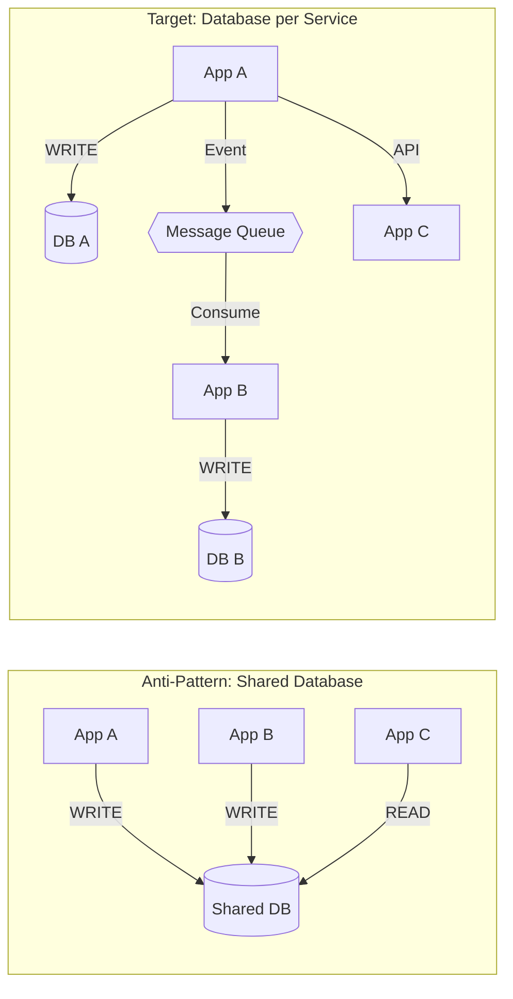
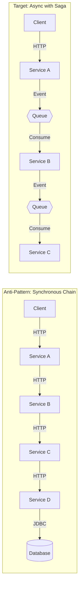
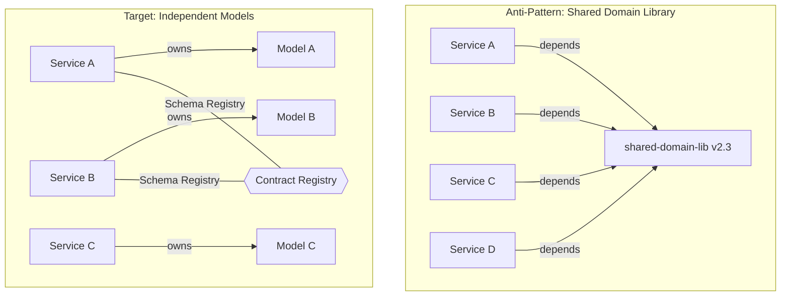
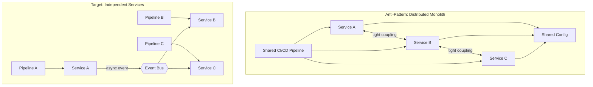
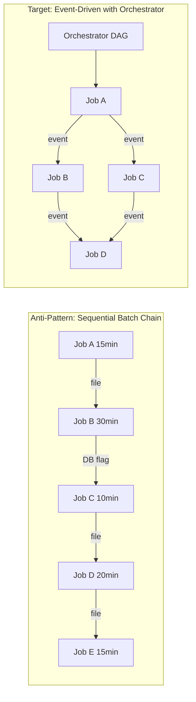

# Coupling Anti-Pattern Reference

A catalog of coupling anti-patterns commonly found in enterprise distributed systems, with detection heuristics, risk scoring criteria, and recommended decoupling strategies.

## Anti-Pattern Catalog

### 1. Integration Database

**Description:** Multiple applications read from and write to the same database tables, using the database as an implicit integration layer. Changes to schema, constraints, or stored procedures can break multiple applications simultaneously.

**Detection Heuristics:**
- Multiple applications reference the same JDBC URL, JNDI datasource name, or connection string
- ORM entity mappings (JPA `@Table`, Hibernate `hbm.xml`) across different codebases reference identical table names
- SQL queries in separate applications target the same tables with write operations (`INSERT`, `UPDATE`, `DELETE`)
- Database migration scripts (Flyway, Liquibase) exist in more than one application for the same schema
- Shared stored procedures called from multiple application codebases

**Risk Score:** CRITICAL when 2+ applications write to the same table. HIGH when one application writes and others read without a defined contract. MEDIUM when applications share read-only access.

**Decoupling Strategy:**
1. Assign clear ownership: one application owns each table and its schema migrations
2. Replace direct reads with API calls or event-driven replication
3. Introduce Change Data Capture (CDC) for consumers that need near-real-time data
4. For reporting consumers, create read replicas or materialized views behind a dedicated service

---

### 2. Synchronous Chain

**Description:** A request triggers a chain of synchronous calls across multiple services, where each service blocks until the downstream service responds. Failure or latency in any link propagates to the entire chain.

**Detection Heuristics:**
- HTTP/REST or gRPC calls nested inside request handlers that themselves serve synchronous endpoints
- Call depth > 3 hops traced through `RestTemplate`, `WebClient`, `Feign`, or gRPC stub invocations
- No circuit breaker configuration (`Resilience4j`, `Hystrix`, `Envoy`) around downstream calls
- Timeout configurations absent or set very high (>30s)
- Distributed tracing data (Zipkin, Jaeger) showing request spans > 3 services deep

**Risk Score:** CRITICAL when chain depth > 5 hops. HIGH when chain depth is 4-5 hops or any link lacks circuit breaker. MEDIUM when chain depth is 3 hops with circuit breakers configured.

**Decoupling Strategy:**
1. Introduce asynchronous messaging for non-critical downstream calls
2. Apply the Saga pattern for multi-step workflows requiring eventual consistency
3. Add circuit breakers and bulkheads at each synchronous boundary
4. Cache responses from stable downstream services to reduce chain depth
5. Consider CQRS to separate read paths (which can be denormalized) from write paths

---

### 3. Shared Library Coupling

**Description:** Multiple services depend on a shared library that contains domain logic, data models, or API contracts. Updates to the shared library force coordinated deployments across all consuming services.

**Detection Heuristics:**
- Internal Maven/Gradle dependency shared across 3+ application modules with domain-specific classes (not pure utilities)
- Shared library contains entity classes, DTOs, or service interfaces used across bounded contexts
- Version pinning conflicts: different applications require different versions of the shared library
- Release notes or changelogs show shared library updates triggering multi-application deployments
- Shared library JAR size > 1MB or contains > 50 classes (indicates excessive scope)

**Risk Score:** CRITICAL when shared library contains mutable domain models used by 5+ services. HIGH when library changes require coordinated deployments. MEDIUM when library is limited to utilities, constants, or pure functions.

**Decoupling Strategy:**
1. Extract domain-specific code into each service that needs it (accept some duplication)
2. Keep shared libraries limited to pure utilities (string manipulation, date formatting, logging wrappers)
3. For API contracts, use schema registries (Protobuf, Avro, OpenAPI) with compatibility rules instead of shared code
4. Apply the Tolerant Reader pattern so consumers ignore unknown fields
5. If shared models are necessary, version them with semantic versioning and maintain backward compatibility

---

### 4. Distributed Monolith

**Description:** A system deployed as microservices but exhibiting monolithic behavior: services must be deployed together, share configuration, fail together, and cannot be developed or scaled independently.

**Detection Heuristics:**
- Deployment pipelines that deploy multiple services atomically (all-or-nothing)
- Shared configuration files or environment variables across service boundaries
- Service startup failures when a peer service is unavailable (temporal coupling)
- Feature development spanning 3+ services for a single user story
- Shared CI/CD pipeline with a single build artifact or release train
- Database migrations that must be coordinated across services
- Integration tests that require the full system to be running

**Risk Score:** CRITICAL when services cannot be deployed independently. HIGH when services share runtime configuration or fail together. MEDIUM when development requires cross-service coordination but deployment is independent.

**Decoupling Strategy:**
1. Define clear bounded contexts and align services to them
2. Introduce API versioning so services can evolve independently
3. Replace shared configuration with service-specific configs and a configuration service
4. Add health checks and graceful degradation so services start without peers
5. Break shared CI/CD pipelines into per-service pipelines
6. Establish team ownership boundaries aligned with service boundaries (Conway's Law)

---

### 5. Temporal Coupling via Batch

**Description:** Applications are coupled through sequential batch processing where Job B depends on the output of Job A, creating invisible runtime dependencies that are not expressed in code but in scheduler configurations.

**Detection Heuristics:**
- Scheduler configs (Control-M, Autosys, cron) with explicit job dependencies or predecessor conditions
- File-based hand-offs: one job writes a file that another job polls for or reads
- Database flag patterns: one job sets a status column that triggers another job's processing
- Batch windows with strict ordering requirements documented only in runbooks
- Jobs that sleep or poll waiting for a predecessor's output

**Risk Score:** CRITICAL when batch chain failure cascades to downstream business processes. HIGH when chain length > 5 jobs or total window > 6 hours. MEDIUM when chains are short with proper error handling and alerting.

**Decoupling Strategy:**
1. Replace file-based hand-offs with event-driven triggers (job completion events)
2. Introduce an orchestrator (Airflow, Cloud Composer, Prefect) with explicit DAG definitions
3. Convert sequential independent jobs to parallel execution
4. Replace polling patterns with push-based notifications
5. Add idempotency to each job so failed chains can be restarted at any point

---

## Risk Scoring Summary

| Anti-Pattern | CRITICAL Threshold | HIGH Threshold | MEDIUM Threshold |
|-------------|-------------------|----------------|------------------|
| Integration Database | 2+ apps write same table | 1 writer, N readers without contract | Shared read-only access |
| Synchronous Chain | Chain depth > 5 | Depth 4-5 or no circuit breaker | Depth 3 with circuit breakers |
| Shared Library | Domain models in 5+ services | Coordinated deployments required | Utility-only sharing |
| Distributed Monolith | Cannot deploy independently | Shared config or co-failure | Cross-service dev coordination |
| Temporal Batch Coupling | Cascade to business processes | Chain > 5 jobs or window > 6h | Short chains with error handling |

## Overall Coupling Score

When assessing a system, compute an aggregate coupling score:

1. Count instances of each anti-pattern
2. Weight by risk level: CRITICAL = 3, HIGH = 2, MEDIUM = 1
3. Sum all weighted scores
4. Classify the system:
   - **Score 0-5**: Low coupling — ready for incremental modernization
   - **Score 6-15**: Moderate coupling — targeted decoupling needed before migration
   - **Score 16+**: High coupling — significant refactoring required; prioritize breaking CRITICAL patterns first

## Decoupling Priority Order

When multiple anti-patterns are present, address them in this order:

1. **Circular dependencies** — These block any extraction; break cycles first
2. **Integration database** — Assign table ownership and introduce API/event boundaries
3. **Synchronous chains** — Add circuit breakers immediately, then convert to async
4. **Distributed monolith** — Separate CI/CD and configuration before further decomposition
5. **Shared libraries** — Extract domain logic into owning services
6. **Temporal batch coupling** — Introduce orchestration and event-driven triggers
