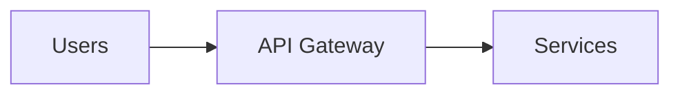

# Diagram Guide for Zen Presenter

How to include diagrams in Zen-style presentations. Diagrams should follow Zen principles: minimal, metaphorical, and visually clean.

## MARP Limitation

MARP has no native Mermaid or diagram rendering support. Diagrams must be pre-rendered as images (SVG or PNG) and embedded using standard MARP image syntax.

## Approach A: Pre-rendered SVG (Recommended)

The most reliable method. Create diagrams externally, export as SVG, embed as images.

### Workflow

1. **Create the diagram** using [mermaid.live](https://mermaid.live), a local editor, or Mermaid CLI.
2. **Export as SVG** (preferred) or PNG.
3. **Place the file** alongside the deck (e.g., `./diagrams/flow.svg`).
4. **Embed in MARP** using image syntax.

### MARP Embedding Syntax

Full-bleed background (diagram fills the slide):
```markdown

```

Inline image below text:
```markdown
# The Flow


```

Split layout (diagram on one side, text on the other):
```markdown


# Simple Flow
```

### Mermaid CLI

Render SVG locally without a browser:

```bash
npx -p @mermaid-js/mermaid-cli mmdc -i diagram.mmd -o diagram.svg --theme neutral
```

Batch render all diagrams in a directory:

```bash
npx -p @mermaid-js/mermaid-cli mmdc -i diagrams/ -o output/ -e svg
```

Recommended Mermaid themes for Zen decks:
- `neutral` — clean, minimal lines (default recommendation)
- `dark` — for slides with dark backgrounds
- `forest` — muted green tones for Earth & Organic presets

## Approach B: Kroki URL-Based Rendering

Encode diagram source as a URL. No local tooling needed, but requires internet.

### Workflow

1. **Write the diagram** in Mermaid syntax.
2. **Base64-encode** the source:
   ```bash
   echo 'graph LR; A-->B-->C' | base64 | tr -d '\n'
   ```
3. **Embed as image URL** in MARP:
   ```markdown
   
   ```

Kroki also supports PlantUML, Graphviz, D2, and other diagram formats using the same URL pattern: `https://kroki.io/{type}/svg/{base64}`.

## Approach C: Mermaid CLI Batch Workflow

For decks with multiple diagrams, set up a build step:

```bash
# 1. Create a diagrams/ folder with .mmd files
mkdir -p diagrams

# 2. Render all to SVG
for f in diagrams/*.mmd; do
  npx -p @mermaid-js/mermaid-cli mmdc -i "$f" -o "${f%.mmd}.svg" --theme neutral
done

# 3. Build the deck
npx @marp-team/marp-cli@latest deck.md --html --theme gcloud-theme.css -o deck.html
```

## Zen Diagram Style Guidelines

Diagrams in Zen presentations must respect the core principles of restraint (Kanso), naturalness (Shizen), and emptiness (Ma).

### Rules

| Principle | Rule |
|-----------|------|
| **Restraint** | Maximum 3-4 nodes per diagram. If you need more, split across slides. |
| **Simplicity** | Use flowcharts or simple sequences. Avoid class diagrams, ER diagrams, or Gantt charts. |
| **One idea** | Each diagram communicates one relationship or flow. Not a system overview. |
| **No text walls** | Node labels: 1-3 words maximum. Edge labels: optional, 1-2 words. |
| **Color** | Use one accent color from the theme (e.g., Google blue `#4285F4`). No rainbow diagrams. |
| **Scale** | Diagrams must be legible at presentation scale — large nodes, thick edges. |

### What Works

- Simple flow: `A --> B --> C`
- Binary decision: `A -->|yes| B` / `A -->|no| C`
- Three-component architecture: `Client --> API --> Database`
- Before/after pair: two minimal diagrams on adjacent slides

### What Doesn't Work

- System architecture with 10+ components
- Detailed sequence diagrams with many actors
- Entity-relationship diagrams
- Anything that needs a legend

## Example Slides

### Simple Architecture Flow

**Mermaid source** (`diagrams/flow.mmd`):


**MARP slide:**
```markdown
---


```

### Split Layout with Text

**MARP slide:**
```markdown
---


# Three layers
```

### Before/After Comparison

Use two consecutive slides, each with a minimal diagram:

**Slide 1 — Before:**
```markdown
---
<!-- _class: invert -->

# Before


```

**Slide 2 — After:**
```markdown
---

# After


```
